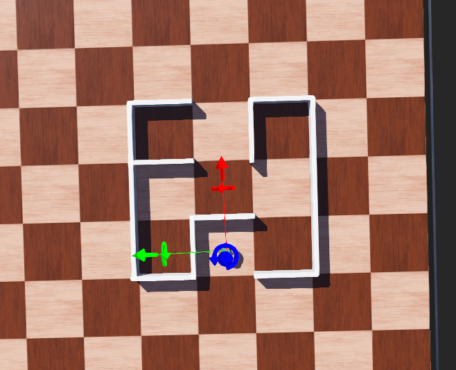
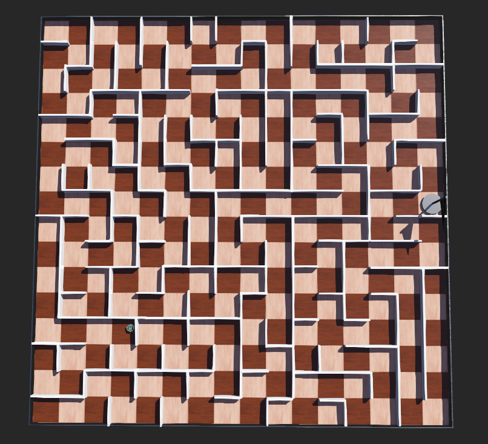

## แผนที่ใน Webots

นี่คือตัวอย่างแผนที่ที่สร้างขึ้นใน Webots:




### 1. Distance Sensors (เซ็นเซอร์วัดระยะ)
* **จำนวน:** 8 ตัว (ps0 - ps7)
* **หน้าที่:** ตรวจจับกำแพงและวัตถุรอบตัวหุ่นยนต์

### 2. GPS (Global Positioning System)
* **จำนวน:** 1 ตัว
* **หน้าที่:** ระบุพิกัดที่แม่นยำของหุ่นยนต์ในฉาก (World)
* **การทำงาน:** ในขณะที่หุ่นยนต์กำลังอยู่ในสถานะ **"เดินไต่กำแพง"** โปรแกรมจะอ่านค่าพิกัด `(x, y, z)` จาก GPS เป็นระยะๆ 

### 3. Inertial Unit (IMU)
* **จำนวน:** 1 ตัว
* **หน้าที่:** วัดทิศทางการหันและมุมของหุ่นยนต์
* **การทำงาน:** เมื่อหุ่นยนต์ถึงจุดหมายและเข้าสู่สถานะ **"เดินทางกลับ"** โปรแกรมจำเป็นต้องรู้ว่าหุ่นยนต์กำลังหันหน้าไปทางไหน

# E-puck Wall Following Controller 

นี่คือตัวอย่างแผนที่ที่สร้างขึ้นใน Webots:



จุดหมายคือเดินไปหาธงให้ได้

## 🧠 หลักการทำงาน

1. หุ่นยนต์ตรวจจับระยะทางรอบตัวด้วย proximity sensors (ps0 - ps7)
2. ระบบจะควบคุมทิศทางของล้อซ้ายและขวาให้เดินชิดกำแพงด้านซ้าย
3. คำนวณพิกัดตำแหน่ง (X, Z) และมุมหันหน้า (Theta) ของหุ่นยนต์ด้วย odometry
4. แสดงค่าตำแหน่งและข้อมูลจาก sensor ทาง console

---

## 🔧 อุปกรณ์ที่ใช้งาน

| อุปกรณ์            | รายละเอียด                                  |
|-------------------|----------------------------------------------|
| มอเตอร์ซ้าย/ขวา   | `"left wheel motor"` และ `"right wheel motor"` |
| Encoder           | `"left wheel sensor"` และ `"right wheel sensor"` |
| Proximity Sensors | `"ps0"` ถึง `"ps7"` (ใช้ ps0, ps1, ps6, ps7)   |

---

## 🧾 ค่าที่คำนวณและจัดเก็บ

| ตัวแปร      | ความหมาย                                |
|-------------|------------------------------------------|
| `x, z`      | ตำแหน่งของหุ่นยนต์ในแนวแกน X, Z         |
| `theta`     | มุมหันหน้าของหุ่นยนต์ (rad)             |
| `d_left`    | ระยะทางที่ล้อซ้ายเคลื่อนที่ (m)         |
| `d_right`   | ระยะทางที่ล้อขวาเคลื่อนที่ (m)         |
| `d_center`  | ระยะทางเฉลี่ยที่หุ่นยนต์เคลื่อนที่ (m)  |
| `d_theta`   | มุมที่หุ่นยนต์หมุนจากการต่างของล้อ      |

---

## 🎯 เงื่อนไขการเคลื่อนที่

```python
if front_left > threshold or front_right > threshold:
    # มีสิ่งกีดขวางด้านหน้า → เลี้ยวขวา
elif left < threshold:
    # ไม่มีผนังซ้าย → เลี้ยวซ้ายหา
else:
    # เดินตรงชิดซ้าย
